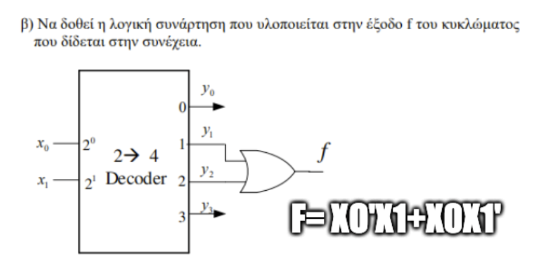
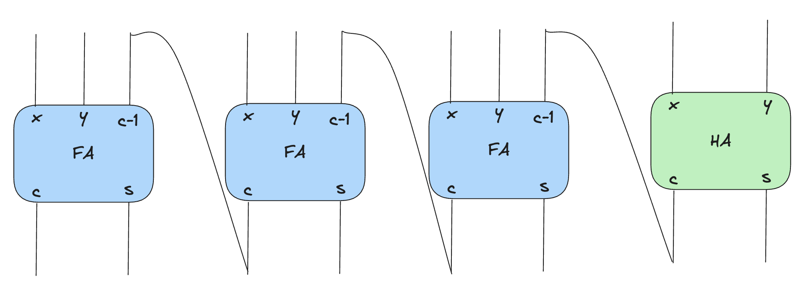
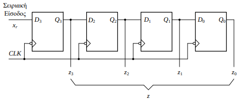

(Θέματα Ευστ)
### 1 Να μετατραπεί στο δεκαεξαδικό και στο οκταδικό σύστμα ο δυαδικός 0.10111101011

Για να μετατρέψουμε τον δυαδικό αριθμό 0.10111101011 στο δεκαεξαδικό και στο οκταδικό σύστημα, πρέπει να κάνουμε τις εξής βήματα:

Δυαδικός αριθμός: 0.10111101011

Μετατροπή σε Οκταδικό:
Συμπληρώνουμε με μηδενικά τον αριθμό ώστε να έχει ομάδες των 3 ψηφίων από το δεκαδικό σημείο και προς τα δεξιά:

0.101 111 010 110

Μετατρέπουμε κάθε ομάδα στον αντίστοιχο οκταδικό αριθμό:

(101) 2 = (5) 8
(111) 2 = (7) 8
(010) 2 = (2) 8
(110) 2 = (6) 8

Έτσι, ο αριθμός στο οκταδικό σύστημα είναι: 0.5726

Μετατροπή σε Δεκαεξαδικό:
Συμπληρώνουμε με μηδενικά τον αριθμό ώστε να έχει ομάδες των 4 ψηφίων από το δεκαδικό σημείο και προς τα δεξιά:

0.1011 1101 0110

Μετατρέπουμε κάθε ομάδα στον αντίστοιχο δεκαεξαδικό αριθμό:

(1011) 2 = (B) 16
(1101) 2 = (D) 16
(0110) 2 = (6)  16

Έτσι, ο αριθμός στο δεκαεξαδικό σύστημα είναι: 0.BD6

Συνοψίζοντας, ο δυαδικός αριθμός 0.10111101011 μετατρέπεται σε:

Οκταδικό: 0.5726
Δεκαεξαδικό: 0.BD6

### 2

|00|01|11|10|
|---|---|---|---|
|0|0|1|1| 
|0|1|1|1|
|1|1|1|0|
|1|1|0|0|

#### Groups
* xz'
* yw
* x'z

```
f(x, y, z, w) = xz' + yw + x'z
```

### 3 Να δοθεί λογικό σύμβολο και ο πίνακας αλήθειας του 2->4 αποκωδικοποιητή με είσοδο επίτρεψης( e ). Η λύση επί του θέματος




### 4 Να δοθεί το λογικό σύμβολο και ο πίνακας αλήθειας ενός 4->1 πολυπλέκτη με είσοδο επίτρεψης ( e ).


#### 5 Να δωθούν οι κατάλληλες συνδέσεις στους πλήρης αθροιστές και τον ημιαθροιστή που δίνονται στην συνέχεια ώστε να δημιουργηθεί ένας **παράλληλος αθροιστής** των τεσσάρων bit. Σημειώστε το κρατούμενο εξόδου.



#### 6 Να γίνουν οι πράξεις που περιγράφονται στην συνέχεια στο δυαδικό σύστημα. Θεωρήστε ότι οι αριθμοί είναι προσημασμένοι σε σύστημα συμπληρώματος του 2. Αναφέρατε τον χειρισμό του κρατούμενου για τον υπολογισμό του αποτελέσματος. Σε ποιές από αυτές υπάρχει υπερχείλιση. Η λύση επί του θέματος. 

```
  1000 + 1101 = 10101
```
 The resulting result is 5-bit, thus indicating the overflow. If we ignore the additional Most Significant Bit (MSB), we arrive at the 4-bit result: 0101, which corresponds to 5 in the decimal system. The correct addition should be -8 + (-3) = -11, however, due to the overflow, we end up with 5.


```
0111 + 0101 = 1100
```

#  Convert SR Flip Flop to D and JK using only basic logic gates (2 inputs) 


#### 8. Make the waves table for the below . Assume z0=z1=0.

![[z0-z1-task-1.png]]

| Clock | D0 | Q0 | D1 | Q1| 
|---|---|---|---|---|
| 1 | 1 | 1 | 0 | 0 |
| 2 | 1 | 1 | 1 | 1 |


# Give the outputs of the flip-flops of the circuit given below during the successive application of two clock pulses. Assume that initially Q0=Q1=0.


# Make the appropriate connections to the D flip-flops given below to form a left-to-right 4-bit shifter.


