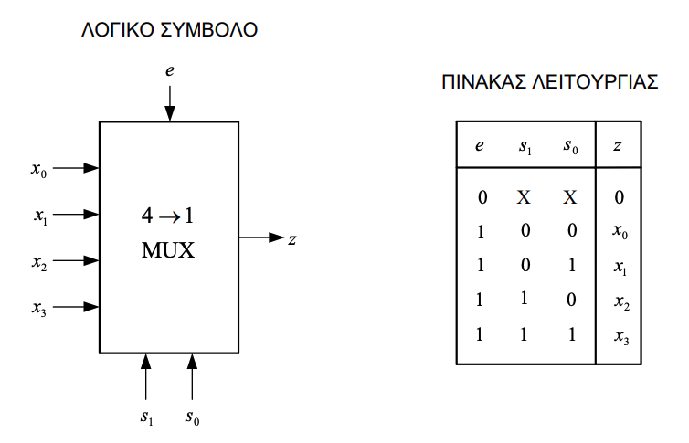

# Convert Decimal to Hex and Octal 

```
0.10111101011
```

## Octal:
Συμπληρώνουμε με μηδενικά τον αριθμό ώστε να έχει ομάδες των 3 ψηφίων από το δεκαδικό σημείο και προς τα δεξιά:

```
0.101 111 010 110
```

```
(101) 2 = (5) 8
(111) 2 = (7) 8
(010) 2 = (2) 8
(110) 2 = (6) 8
0.5726
```

## Hex:
Cut in Members of 4


```
0.1011 1101 0110
```

```
(1011) 2 = (B) 16
(1101) 2 = (D) 16
(0110) 2 = (6)  16

0.BD6
```

# Solve the below k-map

|00|01|11|10|
|---|---|---|---|
|0|0|1|1| 
|0|1|1|1|
|1|1|1|0|
|1|1|0|0|

```
f(x, y, z, w) = xz' + yw + x'z
```

### 3 Να δοθεί λογικό σύμβολο και ο πίνακας αλήθειας του 2->4 αποκωδικοποιητή με είσοδο επίτρεψης( e ). Η λύση επί του θέματος


### 4 Να δοθεί το λογικό σύμβολο και ο πίνακας αλήθειας ενός 4->1 πολυπλέκτη με είσοδο επίτρεψης ( e ).



#### 5 Να δωθούν οι κατάλληλες συνδέσεις στους πλήρης αθροιστές και τον ημιαθροιστή που δίνονται στην συνέχεια ώστε να δημιουργηθεί ένας **παράλληλος αθροιστής** των τεσσάρων bit. Σημειώστε το κρατούμενο εξόδου.


#### 6 Να γίνουν οι πράξεις που περιγράφονται στην συνέχεια στο δυαδικό σύστημα. Θεωρήστε ότι οι αριθμοί είναι προσημασμένοι σε σύστημα συμπληρώματος του 2. Αναφέρατε τον χειρισμό του κρατούμενου για τον υπολογισμό του αποτελέσματος. Σε ποιές από αυτές υπάρχει υπερχείλιση. Η λύση επί του θέματος. 

```
  1000 + 1101 = 10101
```
 The resulting result is 5-bit, thus indicating the overflow. If we ignore the additional Most Significant Bit (MSB), we arrive at the 4-bit result: 0101, which corresponds to 5 in the decimal system. The correct addition should be -8 + (-3) = -11, however, due to the overflow, we end up with 5.


```
0111 + 0101 = 1100
```

#  Convert SR Flip Flop to D and JK using only basic logic gates (2 inputs) 


#### 8. Make the waves table for the below . Assume z0=z1=0.

![[z0-z1-task-1.png]]

(I am not very confident with Z1)
![[Screenshot 2023-07-04 at 11.21.10 AM.png]]

# Make the appropriate connections to the D flip-flops given below to form a left-to-right 4-bit shifter.


# Make the appropriate connections to the D flip-flops given below to form a right-to-left 4-bit shifter.

