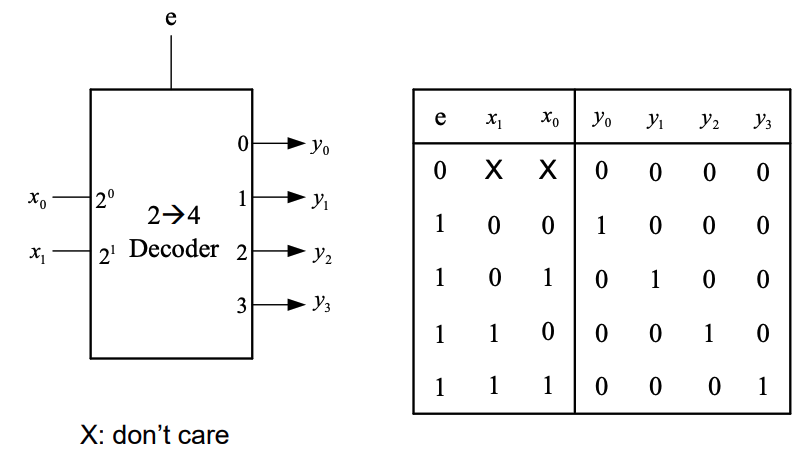

(Θέματα Ευστ)
### 1 Να μετατραπεί στο δεκαεξαδικό και στο οκταδικό σύστμα ο δυαδικός 0.10111101011

Για να μετατρέψουμε τον δυαδικό αριθμό 0.10111101011 στο δεκαεξαδικό και στο οκταδικό σύστημα, πρέπει να κάνουμε τις εξής βήματα:

Δυαδικός αριθμός: 0.10111101011

Μετατροπή σε Οκταδικό:
Συμπληρώνουμε με μηδενικά τον αριθμό ώστε να έχει ομάδες των 3 ψηφίων από το δεκαδικό σημείο και προς τα δεξιά:

0.101 111 010 110

Μετατρέπουμε κάθε ομάδα στον αντίστοιχο οκταδικό αριθμό:

(101) 2 = (5) 8
(111) 2 = (7) 8
(010) 2 = (2) 8
(110) 2 = (6) 8

Έτσι, ο αριθμός στο οκταδικό σύστημα είναι: 0.5726

Μετατροπή σε Δεκαεξαδικό:
Συμπληρώνουμε με μηδενικά τον αριθμό ώστε να έχει ομάδες των 4 ψηφίων από το δεκαδικό σημείο και προς τα δεξιά:

0.1011 1101 0110

Μετατρέπουμε κάθε ομάδα στον αντίστοιχο δεκαεξαδικό αριθμό:

(1011) 2 = (B) 16
(1101) 2 = (D) 16
(0110) 2 = (6)  16

Έτσι, ο αριθμός στο δεκαεξαδικό σύστημα είναι: 0.BD6

Συνοψίζοντας, ο δυαδικός αριθμός 0.10111101011 μετατρέπεται σε:

Οκταδικό: 0.5726
Δεκαεξαδικό: 0.BD6

### 2

#### Groups
* xz
* xw'
* yz'

Συνδυάστε τις εκφράσεις για όλες τις ομάδες χρησιμοποιώντας τον τελεστή OR:
f(x, y, z, w) = xz + xw' + yz'

Έτσι, η ελαχιστοποιημένη δυαδική συνάρτηση χρησιμοποιώντας τον χάρτη Karnaugh είναι:
f(x, y, z, w) = xz + xw' + yz'

### 3 Να δοθεί λογικό σύμβολο και ο πίνακας αλήθειας του 2->4 αποκωδικοποιητή με είσοδο επίτρεψης. Η λύση επί του θέματος

### 4 Να δοθεί το λογικό σύμβολο και ο πίνακας αλήθειας ενός 4->1 πολυπλέκτη με είσοδο επίτρεψης.

![[Screenshot 2023-03-25 at 9.04.28 PM.png]]

#### 5 Να δωθούν οι κατάλληλες συνδέσεις στους πλήρης αθροιστές και τον ημιαθροιστή που δίνονται στην συνέχεια ώστε να δημιουργηθεί ένας **παράλληλος αθροιστής** των τεσσάρων bit. Σημειώστε το κρατούμενο εξόδου.

![[Pasted image 20230401094201.png]]
Το τελευταίο c είναι το κρατούμενο

#### 6 Να γίνουν οι πράξεις που περιγράφονται στην συνέχεια στο δυαδικό σύστημα. Θεωρήστε ότι οι αριθμοί είναι προσημασμένοι σε σύστημα συμπληρώματος του 2. Αναφέρατε τον χειρισμό του κρατούμενου για τον υπολογισμό του αποτελέσματος. Σε ποιές από αυτές υπάρχει υπερχείλιση. Η λύση επί του θέματος. 

  1000 + 1101 = 10101
 
Το αποτέλεσμα έχει 5 bit, υποδεικνύοντας υπερχείλιση. Αγνοώντας το επιπλέον MSB, παίρνουμε το αποτέλεσμα 4-bit: 0101, το οποίο είναι 5 στο δεκαδικό. Η σωστή πρόσθεση πρέπει να είναι -8 + (-3) = -11, αλλά λόγω υπερχείλισης, πήραμε 5.

   0111 + 0101 = 1100

Το αποτέλεσμα είναι 1100, αριθμός 4 bit. Εφόσον το MSB είναι «1», ο αριθμός είναι αρνητικός. Για να βρείτε τη δεκαδική αναπαράστασή του, υπολογίστε το συμπλήρωμα του 2:

Αντιστρέψτε τα bit: 0011
Προσθέστε 1 στο αποτέλεσμα: 0011 + 0001 = 0100
Άρα, το 1100 στο δυαδικό είναι -4 στο δεκαδικό. Η πρόσθεση είναι σωστή: 7 + 5 = 12, αλλά επειδή εργαζόμαστε με αριθμούς 4-bit, σημειώθηκε υπερχείλιση, με αποτέλεσμα -4.

#### 7. Να μετατραπούν τα SR flip-flop που δίνονται στην συνέχεια σε D και JK flip-flop. Για την μετατροπή έχετε στην διάθεση σας τις βασικές λογικές πύλες (AND-2, OR-2, NOT, NAND-2, NOR-2, XOR-2, XNOR-2)

![[Screenshot 2023-03-25 at 11.08.35 PM.png]]

![[master_slave_jk.png]]

#### 8. Να σχεδιασθούν οι κυματομορφές στις εξόδους του κυκλώματος που δίδεται στην συνέχεια. Υποθέστε ότι αρχικά z0=z1=0.

![[Pasted image 20230401102147.png]]

![[Pasted image 20230401122334.png]]

### 9. Να δοθούν οι έξοδοι των φλιπ-φλοπ του κυκλώματος που δίνεται στην συνέχεια κατά την διαδοχική εφαρμογή δύο παλμών ωρολογίου. Υποθέστε ότι αρχικά Q0=Q1=0.

![[Pasted image 20230401132510.png]]

### 10. Να γίνουν οι κατάλληλες συνδέσεις στα D φλιπ φλοπ που δίδονται στην συνέχεια ώστε να αποτελούν έναν ολισθητή των 4 bit από αριστερά προς τα δεξιά. 

![[Pasted image 20230401133327.png]]
