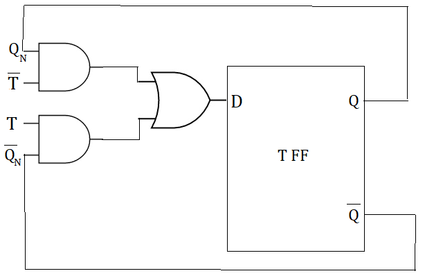

# D to SR Flip-Flop Conversion

## Step 1: Identify Available and Required Flip-Flops
In this example, we have a D flip-flop, and we want to convert it to an SR flip-flop.

## Step 2: Make Characteristic Table for Required Flip-Flop

A matrix for the values

| Qn | Qn+1 | S | R |
|----|------|---|---|
|  0 |   0  | 0 |  X |
|  0 |   1  | 1 |  X |
|  1 |   0  | X |  1 |
|  1 |   1  | X |  0 |

## Step 3: Make Excitation Table for Available Flip-Flop

A sequel of the previous matrix that includes new values

| Qn | Qn+1 | S | R | SRBar |
|----|------|---|---|-------|
|  0 |   0  | 0 |  X |   1   |
|  0 |   1  | 1 |  X |   0   |
|  1 |   0  | X |  1 |   0   |
|  1 |   1  | X |  0 |   0   |

## Step 4: Write Boolean Expression for Available Flip-Flop
The boolean expressions for an SR flip-flop are:

S = D
R = D'

## Step 5: Draw the Circuit

# D to T Flip-Flop Conversion

## Step 1: Identify Available and Required Flip-Flops
In this example, we have a D flip-flop, and we want to convert it to a T flip-flop.

## Step 2: Make Characteristic Table for Required Flip-Flop

| Qn | Qn+1 | T |
|----|------|---|
|  0 |   0  | 0 |
|  0 |   1  | 1 |
|  1 |   0  | 0 |
|  1 |   1  | 1 |

## Step 3: Make Excitation Table for Available Flip-Flop

| Qn | Qn+1 | T |
|----|------|---|
|  0 |   0  | 0 |
|  0 |   1  | 1 |
|  1 |   0  | 0 |
|  1 |   1  | 1 |

## Step 4: Write Boolean Expression for Available Flip-Flop
The boolean expression for a T flip-flop is:

T = D

## Step 5: Draw the Circuit

# D to JK Flip-Flop Conversion

## Step 1: Identify Available and Required Flip-Flops
In this example, we have a D flip-flop, and we want to convert it to a JK flip-flop.

## Step 2: Make Characteristic Table for Required Flip-Flop

| Qn | Qn+1 | J | K |
|----|------|---|---|
|  0 |   0  | 0 | X |
|  0 |   1  | 1 | X |
|  1 |   0  | X | 1 |
|  1 |   1  | X | 0 |

## Step 3: Make Excitation Table for Available Flip-Flop

| Qn | Qn+1 | J | K | JKBar |
|----|------|---|---|-------|
|  0 |   0  | 0 | X |   1   |
|  0 |   1  | 1 | X |   0   |
|  1 |   0  | X | 1 |   0   |
|  1 |   1  | X | 0 |   1   |

## Step 4: Write Boolean Expression for Available Flip-Flop
The boolean expressions for a JK flip-flop are:

J = D
K = D'

## Step 5: Draw the Circuit

# References

* https://www.allaboutcircuits.com/technical-articles/conversion-of-flip-flops-part-iv-d-flip-flops/