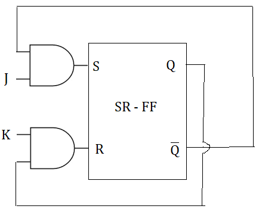

# SR Flip Flop to JK Flip Flop

## Step 1: Identify Available and Required Flip-Flops
In this example, we have a SR flip-flop and
we want to convert it to a JK flip-flop.

## Step 2: Make Characteristic Table for Required Flip-Flop

|Qn|J | K| Qn+1 | Bar |
|---|---|---|--------|
|0| 0 | 0 |   0    |
|0| 0 | 1 |   0    |
|0| 1 | 0 |   1    |
|0| 1 | 1 |   1    |
|1| 0 | 0 |   1    |
|1| 0 | 1 |   0    |
|1| 1 | 0 |   1    |
|1| 1 | 1 |   0    |

## Step 3: Make Excitation Table for Available Flip-Flop

|Qn|Qn+1| S| R |
|---|---|---|---|
|0| 0 | 0 |   X   |
|0| 1 | 1 |   0    |
|1| 0 | 0 |   1    |
|1| 1 |X |   1    |

|Qn|Qn+1 |S| R |
|---|---|---|--------|
|0|   0    |0|X|
|0|   0    |0|X|
|0|   1    |1|0|
|0|   1    |1|0|
|1|   1    |X|0|
|1|   0    |0|1|
|1|  1    |X|0|
|1|   0    |0|1|

## Step 4: Write Boolean Expression for Available Flip-Flop
![[karaugh_for_SR.png]]

### Step 5: Draw the circuit

# SR to T Flip Flop

## Step 1: Identify Available and Required Flip-Flops
In this example, we have a SR flip-flop and
we want to convert it to a T flip-flop.

## Step 2: Make Characteristic Table for Required Flip-Flop

|Qn|T| Qn+1 |
|---|---|---|
|0| 0 | 0 |
|0| 1 | 1 |
|0| 0 | 1 |
|1| 1 | 0 |

## Step 3: Make Excitation Table for Available Flip-Flop

|Qn|T| Qn+1 |S|R|
|---|---|---|---|---|
|0| 0 | 0 |0|X|
|0| 1 | 1 |1|0|
|0| 0 | 1 |X|1|
|1| 1 | 0 |0|1|

## Step 4: Write Boolean Expression for Available Flip-Flop
![[karaugh_for_sr_to_t.png]]

## Step 5: Draw the circuit

![[sr_to_t_drawing.png]]

# SR to D Flip-Flop Conversion

## Step 1: Identify Available and Required Flip-Flops
In this example, we have an SR flip-flop, and we want to convert it to a D flip-flop.

## Step 2: Make Characteristic Table for Required Flip-Flop

| Qn | Qn+1 | D |
|----|------|---|
|  0 |   0  | 0 |
|  0 |   1  | 1 |
|  1 |   0  | 0 |
|  1 |   1  | 1 |

## Step 3: Make Excitation Table for Available Flip-Flop

| Qn | Qn+1 | S | R | D |
|----|------|---|---|---|
|  0 |   0  | 0 | X | 1 |
|  0 |   1  | 1 | X | 0 |
|  1 |   0  | X | 1 | 0 |
|  1 |   1  | X | 0 | 1 |

## Step 4: Write Boolean Expression for Available Flip-Flop
The boolean expressions for an SR flip-flop are:

S = Qn' ⨁ D
R = Qn ⨁ D'

## Step 5: Draw the Circuit

# References

* https://www.allaboutcircuits.com/technical-articles/flip-flop-conversions-part-ii/