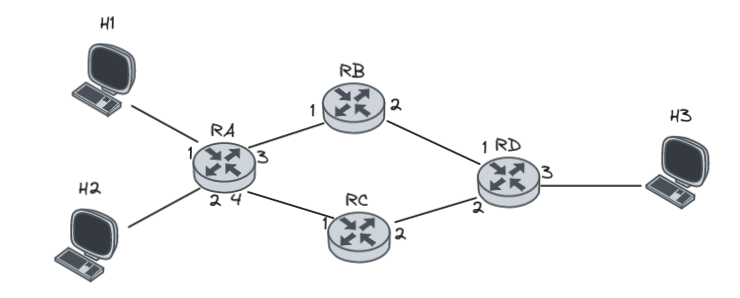

# Task 1
In a stop and wait protocol we consider that the link has a capacity of 1Gb/s and each packet consists of 12000 bits.
What is the utilization factor of the link if the round trip propagation time is:

* RTT= 30 msec
* RTT= 30  μsec;

State, based on the results, the main conclusions about the function of stop and wait protocols.

#### Note

```
Utilization Factor = (Packet Size) / (Link Capacity * RTT)
```

```
The stop and wait protocol is a basic flow control mechanism used for reliable data transmission. The sender sends one packet at a time and waits for an acknowledgment from the receiver before sending the next packet. This ensures error-free transmission but results in low link utilization. More efficient protocols are preferred for high-capacity links.
```

### Answer

* RTT= 30 μsec
```
 Utilization Factor = (12000 bits) / (1 Gbps * 0.03 seconds)
```

Converting 1 Gbps to bits per second: 1 Gbps = 1,000,000,000 bits per second
```
Utilization Factor = (12000 bits) / (1,000,000,000 bits per second * 0.03 seconds)
= 0.0004
```

Therefore, the utilization factor is 0.0004 or 0.04%.

* RTT = 30 msec
```
Utilization Factor = (12000 bits) / (1 Gbps * 30 * 10^(-6) sec)
```

Converting 1 Gbps to bits per second: 1 Gbps = 1,000,000,000 bits per second
```
Utilization Factor = (12000 bits) / (1,000,000,000 bits per second * 30 * 10^(-6) sec)
= 0.04
```

Therefore, the utilization factor is 0.04 or 4%.

Based on this updated calculation, the main conclusions about the function of stop and wait protocols are:

1. The utilization factor is still relatively low at 4%. Although it has increased compared to the previous calculation, it is still indicative of underutilization of the link.
    
2. Stop and wait protocols are not efficient in fully utilizing the available link capacity. The sender has to wait for the acknowledgment of each packet before sending the next one, resulting in idle time and reduced throughput.
    
3. For high-capacity links, stop and wait protocols are even more inefficient due to the increased time spent waiting for acknowledgments.
    
4. Sliding window protocols, such as the Go-Back-N or Selective Repeat, are more suitable for improving link utilization and throughput by allowing the sender to transmit multiple packets before receiving acknowledgments.
    
In summary, stop and wait protocols are not ideal for high-capacity links due to their limited utilization factor. More efficient protocols should be considered to maximize the utilization of the link and improve overall performance.

# Task 2

### Notes
In TCP Reno, the behavior during congestion events follows a specific pattern. When congestion is detected, TCP Reno reduces the congestion window (cwnd) by approximately half. This is known as multiplicative decrease.

More specifically, when a congestion event occurs, TCP Reno cuts the cwnd in half and sets a new value for ssthresh (congestion threshold). The ssthresh value is typically set to the current cwnd divided by 2.

After the cwnd is reduced, TCP Reno enters a phase called slow start. During slow start, the cwnd is increased exponentially, doubling its value for every acknowledgment received. This phase continues until the cwnd reaches the new value of ssthresh.

Once the cwnd reaches or exceeds the ssthresh value, TCP Reno enters a phase known as congestion avoidance. In this phase, the cwnd is increased linearly, adding only a small increment for each acknowledgment received.

* cwnd default value is 1
* 0-5 -> Slow Start -> 32 segments
* 10 linear incremental dots, 32+10 = 42 segments
* Then BOOM! Congestion occures and the segments are now 42/2 = 21 Segments.
* 5 incremental dots therefore 21+5 = 26 segments
* Another congestion was about to happen but I guess they killed the connection

## A
There are 2 significant drops between transmission round 16-18 and 22-22 with linear increase after their recovery so it should be using TCP Reno.

## B
MSS = 200

Round 10: 36 * 200 = 7200 bytes
Round 11: 37 * 200 = 7400 bytes
Round 12: 38 * 200 = 7600 bytes
Round 13: 39 * 200 = 7800 bytes
Round 14: 40 * 200 = 8000 bytes
Round 15: 41 * 200 = 8200 bytes
Round 16: 42 * 200 = 8400 bytes

## C
ssthresh is 17

## D
cwnd 1, therefore the sender is a stage of congestion avoidance.

# Task 3

In Go-Back-N, the sender continues sending a stream of frames without waiting for individual acknowledgments, and if an error or timeout occurs, it re-transmits the entire window of unacknowledged frames. This approach is simple but can lead to unnecessary re-transmissions. 

On the other hand, Selective Repeat allows the receiver to individually acknowledge correctly received frames, allowing the sender to re-transmit only the specific frames that are corrupted or lost. This targeted retransmission minimizes unnecessary retransmissions and improves efficiency. 

TCP one of the core protocols of the Internet, establishes a sliding window protocol that utilizes Selective Repeat for reliable data delivery.

# Task 4

Each host in TCP estimates the RTT to achieve efficient and reliable data transmission.
RTT estimation is crucial for setting appropriate timeouts, detecting network congestion, and triggering retransmissions.

Hosts value RTT estimation as it enables them to optimize their timeout values, adapt congestion control mechanisms, and ensure reliable delivery of data.

# Task 5



In the given datagram network topology, it is not possible to create a forwarding table on Router A that directs all traffic from H1 to H3 through interface 3 and all traffic from H2 to H3 through interface 4. This limitation arises because Router A does not have a direct connection to Router D, where H3 is connected, and thus lacks the necessary information to determine the next hop for H3. To achieve the desired forwarding behavior, a network configuration with additional routing information and routing protocols, such as OSPF or BGP, would be required. Such a setup would enable the exchange of routing information between routers and provide Router A with the necessary details to create a forwarding table that includes the appropriate next hop and outgoing interfaces for H3.

# Task 6

Convert the network addresses to binary form:

```
10.0.8.0/24: 00001010.00000000.00001000.00000000
10.0.19.0/24: 00001010.00000000.00010011.00000000

```

Identify the common bits from the left in the binary representation:

```
Common bits: 00001010.00000000
```

Determine the subnet mask based on the number of common bits:

```
Subnet mask: 11111111.11111111.11100000.00000000 (or /17 in CIDR notation)
```

Convert the subnet mask back to decimal form:

```
Subnet mask: 255.255.224.0
```


The summarized address is the network address combined with the subnet mask:

```
Summary address: 10.0.8.0/17
```

# Task 7
 Autonomous Systems are collections of networks, managed independently by a single organization. They provide routing, connectivity, autonomy, scalability, redundancy, and foster competition. Their interconnections and independent management contribute to the internet's functionality, resilience, and growth.