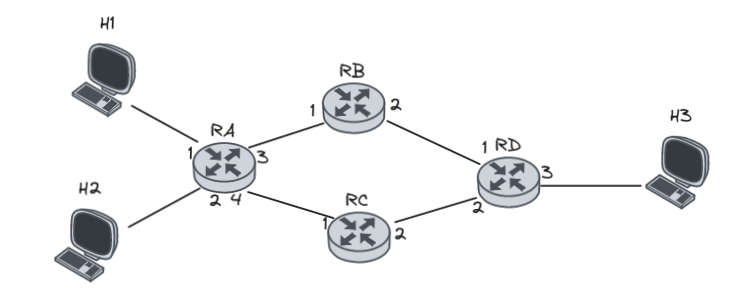

# Exam Questions

# In a stop and wait protocol we consider that the link has a capacity of XGb/s and each packet consists of Y bits. What is the utilization factor of the link if the round trip propagation time is:

## Apply the below formula to get the UF
```
Utilization Factor = (Packet Size) / (Link Capacity * RTT)
```


# How to detect on a Graph if TCP Reno or TCP Tahoe is being used

## _(To the point edition)_

### To detect TCP Reno on a graph:
* Look for aggressive fluctuations and significant drops in the cwnd.
* reacts aggressively to congestion by sharply reducing cwnd.

### To detect TCP Tahoe on a graph:
* Look for a slower and more gradual change in the congestion window (cwnd) without extreme drops.
* It exhibits a more conservative response to congestion compared to TCP Reno.

## *(Longer edition)*

### Examine the congestion window (cwnd) behavior over time on the graph.
Look for aggressive fluctuations and significant drops in cwnd followed by a slower growth rate. This suggests TCP Reno. TCP Reno reacts aggressively to congestion by sharply reducing cwnd.

### Observe the initial phase of cwnd growth on the graph.
If there is a rapid exponential increase in cwnd at the beginning, followed by a more conservative growth rate, it indicates the slow start behavior of TCP Reno.

### Analyze the graph to determine if TCP Reno or TCP Tahoe is being used.

If you observe aggressive fluctuations and significant drops in cwnd, indicating a more aggressive congestion response, it suggests TCP Reno. If the graph shows a slower and more gradual change in cwnd without extreme drops, it suggests TCP Tahoe.

By considering the congestion window behavior and the characteristics of slow start, you can determine whether TCP Reno or TCP Tahoe is being used based on the observed graph.

# How to calculate the number of bytes sent from transmission round X to Y

Multiply the number of segments sent during that time by the MSS. 
For example, if the graph shows a constant cwnd of 20 segments from round 10 to 16, and the MSS is 200 bytes, the total bytes sent would be 20 segments * 200 bytes = 4000 bytes.

## What if cwnd is not constant?
Then you need to sum up the product of each cwnd value with the MSS to calculate the total bytes send.

For example, let's say the cwnd values for rounds 10 to 16 are as follows: 18, 15, 20, 17, 19, 16, 21. Assuming the MSS is 200 bytes, the calculation would be as follows:

```
Total bytes sent = (cwnd10 * MSS) + (cwnd11 * MSS) + (cwnd12 * MSS) + (cwnd13 * MSS) + (cwnd14 * MSS) + (cwnd15 * MSS) + (cwnd16 * MSS)
```

```
Total bytes sent = (18 * 200) + (15 * 200) + (20 * 200) + (17 * 200) + (19 * 200) + (16 * 200) + (21 * 200)
```

```
Total bytes sent = 3600 + 3000 + 4000 + 3400 + 3800 + 3200 + 4200 = 22,200bytes
```

# How to detect the value of ssthresh

Look for the point in the graph where the congestion window transitions from the slow start phase to the congestion avoidance phase.
The ssthresh is typically set when TCP Reno encounters a congestion event and reduces cwnd significantly. Look for a sharp drop in cwnd that precedes the slower growth pattern.

# How to find the cwnd at transmission round X
Locate the corresponding point on the graph at round X on the X-axis. Then, identify the value of cwnd at that point on the Y-axis.
It represents the cwnd value at transmission round X.


# Differences between Go-back-N and Selective Repeat

In Go-Back-N, the sender continues sending a stream of frames without waiting for individual acknowledgments, and if an error or timeout occurs, it re-transmits the entire window of unacknowledged frames. This approach is simple but can lead to unnecessary re-transmissions. 

On the other hand, Selective Repeat allows the receiver to individually acknowledge correctly received frames, allowing the sender to re-transmit only the specific frames that are corrupted or lost. This targeted retransmission minimizes unnecessary retransmissions and improves efficiency. 

TCP one of the core protocols of the Internet, establishes a sliding window protocol that utilizes Selective Repeat for reliable data delivery.


# Why each host should estimate RTT round trip propagation time in TCP. How is it valued by hosts?

Each host in TCP estimates the RTT to achieve efficient and reliable data transmission.
RTT estimation is crucial for setting appropriate timeouts, detecting network congestion, and triggering retransmissions.

Hosts value RTT estimation as it enables them to optimize their timeout values, adapt congestion control mechanisms, and ensure reliable delivery of data.


# You are given a network "insert picture here"

There are 4 Routers RA,RB,RC,RD and 3 computer H1,H2,H3.

H1 is connected to RA's interface 1,
H2 is connected to RA's interface 2,
RA interface 3 is connected to RB interface 1
RA interface 4 is connected to RC interface 1
RB interface 2 is connected to RD interface 1
RC interface 2 is connected to RD interface 2
RD interface 3 is connected to H3



Assume this is a datagram network. Answer with reason if you can make a forwarding table on Router A so that all traffic from H1 directed to H3 is forwarded from RA's interface 3 and all traffic directed from H2 to H3 is forwarded from RA's interface 4, If your answer is negative then indicate what kind of network can support this function.

## Answer

In the given datagram network topology, it is not possible to create a forwarding table on Router A that directs all traffic from H1 to H3 through interface 3 and all traffic from H2 to H3 through interface 4. This limitation arises because Router A does not have a direct connection to Router D, where H3 is connected, and thus lacks the necessary information to determine the next hop for H3. To achieve the desired forwarding behavior, a network configuration with additional routing information and routing protocols, such as OSPF or BGP, would be required. Such a setup would enable the exchange of routing information between routers and provide Router A with the necessary details to create a forwarding table that includes the appropriate next hop and outgoing interfaces for H3.

# Assume that an ABR in OSPF has its perimeter on networks 10.0.8.0/24 to 10.0.19.0/24. Mention a way to do summarization of these networks (not necessarily in a prefix).

* Determine the range of networks to be summarized. In this case, the range is from 10.0.8.0/24 to 10.0.19.0/24.

* Calculate the most concise summary address that encompasses the entire range of networks. To do this, find the common bits in the network addresses.

* Convert the network addresses to binary form:
```
10.0.8.0/24: 00001010.00000000.00001000.00000000
10.0.19.0/24: 00001010.00000000.00010011.00000000
```

* Identify the common bits from the left in the binary representation:
```
Common bits: 00001010.00000000.00001
```

* Determine the subnet mask based on the number of common bits:
```
Subnet mask: 11111111.11111111.11111000.00000000 (or /21 in CIDR notation)
```

* Convert the subnet mask back to decimal form:
```
Subnet mask: 255.255.248.0
```

* The summarized address is the network address combined with the subnet mask:
```
Summary address: 10.0.8.0/21
```


# Explain what is the utility of Autonomous Systems on the internet.
 
 Autonomous Systems are collections of networks, managed independently by a single organization. They provide routing, connectivity, autonomy, scalability, redundancy, and foster competition. Their interconnections and independent management contribute to the internet's functionality, resilience, and growth.