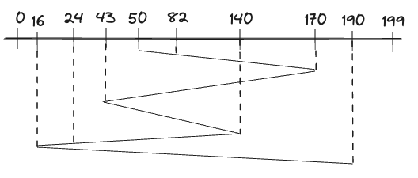

The goal of disk scheduling is to optimize the access and retrieval of data from a computer's disk storage system. It involves determining the order in which pending input/output (I/O) requests should be serviced by the disk controller to minimize the overall access time and maximize disk utilization.

* Seek Time: The time required for the read/write heads to move to the desired track on the disk.

* Rotational Latency: The time it takes for the desired sector of the disk to rotate under the read/write heads.

* Transfer Time: The time required to transfer the requested data to or from the disk.

* Request Arrival Time: The time at which an I/O request is made to the disk.

* Current Head Position: The current location of the read/write heads on the disk.

* Queue Length: The number of pending I/O requests in the disk queue.

# Algorithms used

## First-Served (FCFS):
I/O requests are serviced in the order they arrive, resulting in a first-in, first-out (FIFO) approach.

### Example
A disk contains 200 threads (0-199), Current position of r/w is 50. 

```
0,16,24,43,50,82,140,170,190
```



Conclude the number of track movements by r/w.

```
	(82-50)        Easier version ->   (170-50)
+   (170-82)                         + (170-43)
+   (170-43)                         + (140-43)
+   (140-43)                         + (140-16)
+   (140-24)                         + (190-16)
+   (24-16)                          -----------------                     
+   (190-16)                           642
-----------------
642
```

## Shortest Seek Time First (SSTF):
The request with the shortest seek time from the current head position is serviced next, minimizing head movement.

### Example
A disk contains 200 threads (0-199), Current position of r/w is 50. 

```
0,16,24,43,50,82,140,170,190
```


Conclude the number of track movements by r/w.

```
    (50-16)
+   (190-16)
-----------------
208
```

If r/w head takes 1ns to move from one track to another then what is the total time taken?

```
208 * 1 = 208ns
```

## SCAN:

The disk arm scans in a particular direction (e.g., from the outermost track to the innermost track or vice versa), servicing requests along the way, until it reaches the end of the disk, and then changes direction. (like a elevator)

### Example
A disk contains 200 threads (0-199), Current position of r/w is 50. 

```
0,16,24,43,50,82,140,170,190
```


Conclude the number of track movements by r/w.

```
    (199-50)
+   (199-16)
-----------------
332
```

If r/w head takes 1ns to move from one track to another then what is the total time taken?

```
332 * 1 = 332ns
```

## C-SCAN:
Similar to SCAN, but the disk arm scans only in one direction, servicing requests along the way until it reaches the end, at which point it quickly moves back to the beginning of the disk to start the next scan.

### Example
A disk contains 200 threads (0-199), Current position of r/w is 50. 

```
0,16,24,43,50,82,140,170,190
```


Conclude the number of track movements by r/w.

```
    (199-50)
    (199-0) (DONT SKIP THIS)
+   (43-0)
-----------------
391
```

## LOOK:
The disk arm scans in a particular direction, servicing requests along the way, but changes direction once it reaches the last requested track, without going to the end of the disk.

### Example
A disk contains 200 threads (0-199), Current position of r/w is 50. 

```
0,16,24,43,50,82,140,170,190
```


Conclude the number of track movements by r/w.

```
    (190-50)
+   (190-16)
-----------------
314
```

If r/w head takes 1ns to move from one track to another then what is the total time taken?

```
314 * 1 = 314ns
```

## C-LOOK:
Similar to LOOK, but the disk arm scans only in one direction, servicing requests along the way until it reaches the last requested track, and then quickly moves back to the beginning of the requested track range.

### Example
A disk contains 200 threads (0-199), Current position of r/w is 50. 

```
0,16,24,43,50,82,140,170,190
```


Conclude the number of track movements by r/w.

```
    (190-50)
    (190-16) (Its important to value this as well)
+   (43-16)
-----------------
341
```