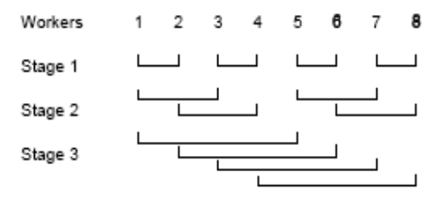

# Peterson's Algorithm

Peterson's algorithm is a synchronization algorithm used to achieve mutual exclusion in a multi-threaded or multi-process environment. It allows two processes to coordinate and take turns accessing a shared resource. The algorithm uses flags and a turn variable to ensure that only one process can enter the critical section at a time.

```
bool in1 = false, in2 = false;
int last = 1; 
process CS1 { 
	while (true) {
		in1 = true;
		last = 1; 
		while (in2 and last == 1) skip; 
		critical section; 
		in1 = false;
		noncritical section;
	} 
}

process CS2 { 
	while (true) { 
		in2 = true;
		last = 2; 
		while (in1 and last == 2) skip;
		critical section; 
		in2 = false; 
		noncritical section; 
	} 
}
```

## N processes version

```
int in[1:n] = ([n] 0), last[1:n] = ([n] 0);
process CS[i = 1 to n] {
	while (true) {
		for [j = 1 to n] {
			 /* entry protocol */
			in[i] = j; 
			last[j] = i;
			for [k = 1 to n st i != k] {
				/* 
					wait if pr k is in higher stage and pr i 
					was the last to enter stage j
				 */
				while (in[k] >= in[i] and last[j] == i) skip;
			}
		}
		critical section;
		in[i] = 0; 
		/* exit protocol */
		noncritical section;
	}
}
```

# Barrier Sync

A barrier sync allows multiple threads or processes to synchronize and wait until all participants have reached a certain point in their execution before continuing. It is commonly used to ensure that all threads/processes have completed a specific phase or task before moving on to the next phase or task.

```
process Worker [i = 1 to n] {
	while (true) { 
		code to implement task i; 
		wait for all n tasks to complete; 
	}
}
```

## Use Case

Barrier synchronization is necessary in cases where processes/threads need to parallelly complete multiple tasks. However, in order to start the next task, they must have finished the previous one.

## Counter Version

```
int count = 0; 
process Worker [i = 1 to n] { 
	while (true) { 
		code to implement task i; 
		< count = count + 1; > 
		/* critical section */ 
		while (count != n) skip; 
	} 
}
```

It adds a unnecessary critical section that will need to be handled, it is also not that performant because of the many writes in counter and last it also requires to handle resetting the counter.

## Using a Coordinator

A 'coordinator' process is defined which controls centrally
(in order to remove some of the disadvantages of the solution with
use 'counter') if they all reached the 'dam' point.

```
int arrive[1:n] = ([n] 0), continue[1:n] = ([n] 0);
process Worker[i = 1 to n] {
	while (true) {
		code to implement task i;
		arrive[i] = 1;
		while (continue[i] != 1) skip;
		continue[i] = 0;
	}
}
process Coordinator {
	while (true) { 
		for [i = 1 to n] { 
			while (arrive[i] != 1) skip;
			arrive[i] = 0;
		}
		for [i = 1 to n] continue[i] = 1;
	} 
}
```


One disadvantage of barrier synchronization is the need for an additional process/processor, while another disadvantage is that the time required to complete synchronization is O(n), where "n" represents the number of participating processes or threads.


## Using a Binary Tree
The organization of processes in a binary tree structure has the following advantages: 
* Each process-node is responsible for synchronizing its own subtree. After finishing, it informs its parent, continuing this process until reaching the root node. 
* The root node signals all processes to continue, running through the tree again from top to bottom. The required time for this synchronization, measured in the number of steps, is O(logn) where "n" represents the number of processes or nodes in the tree.

```
leaf node L: arrive[L] = 1;
while (continue[L] != 1) skip;
continue[L] = 0;

interior node I: while (arrive[left] != 1) skip;
arrive[left] = 0;
while (arrive[right] != 1) skip;
arrive[right] = 0;
arrive[I] = 1;
while (continue[I] != 1) skip;
continue[I] = 0;
continue[left] = 1; continue[right] = 1;

root node R: while (arrive[left] != 1) skip;
arrive[left] = 0;
while (arrive[right] != 1) skip;
arrive[right] = 0;
continue[left] = 1; continue[right] = 1;
```

One disadvantage of organizing processes in a binary tree structure for synchronization is the potential for asymmetric processing. In this structure, some processes/processors may have to perform more work while others have less, leading to an imbalance in processing load. This can result in suboptimal efficiency compared to achieving a more symmetric workload distribution, which could potentially lead to better overall performance in terms of the number of steps required.

# Butterfly 



The organization of processes in a binary tree structure for synchronization offers an advantage in terms of efficiency. It achieves synchronization in O(logn) stages, where at each stage, pairs of processes that are adjacent to each other in the tree are synchronized in parallel. This process continues in a symmetric manner, utilizing the symmetric algorithm for synchronization of two processes that was discussed earlier.

## Changed version

```
// barrier code for worker process ‘i’
for [s = 1 to num_stages] {
	arrive[i] = arrive[i] + 1;
	// determine neighbor ‘j’ for stage ‘s’
	while (arrive[j] < arrive[i]) skip;
}
```

A variation of the 'butterfly' algorithm can be utilized to avoid race conditions. In this variation, where the number of stages is logn, each process declares its presence in each stage by executing the command <arrive[i] = arrive[i] + 1> instead of <arrive[i] = 1>. By incrementing the 'arrive' value, conflicts in updating the shared variable are avoided, ensuring proper synchronization and preventing race conditions.